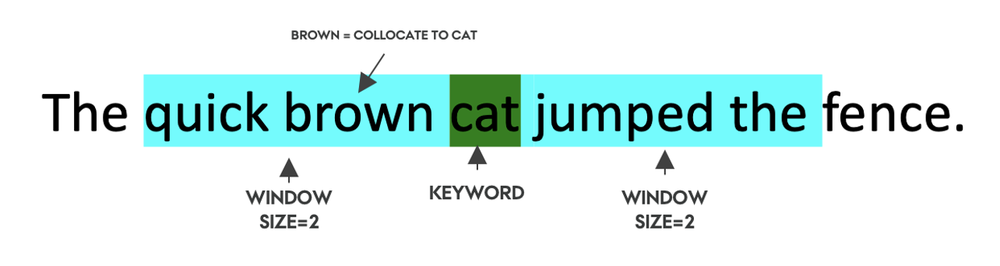
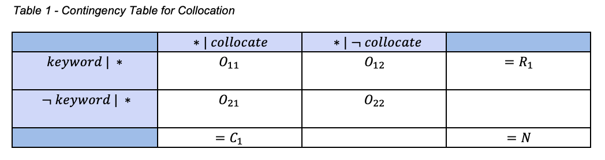
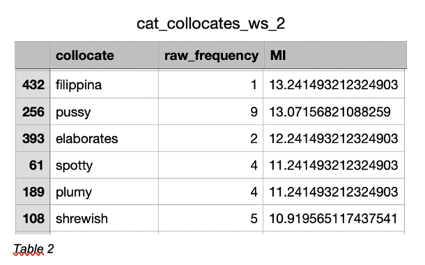

# A2 – Collocation: Quantifying the Association Between Words 

# Overview 

**Jakob Grøhn Damgaard, May 2021** <br/>
This folder contains  assigmnent 2 for the course *Language Analytics*

# Description
*“You shall know a word by the company it keeps!”* (Firth, 1957). These renowned words (paraphrased) were written over 60 years ago but still form the foundation of the study of distributional semantics and language structure in general. Today, modern state-of-the-art machine learning models still represent the semantics of a word by analysing the context words that surround it (Wolf et al., 2018). A common, and more simple, approach from corpus linguistics for analysing and quantifying inter-word relationships is to look at word collocation. From a statistical point-of-view, two words are referred to as collocates, when they regularly appear closely together (within a designated span of words from each other) to such an extent that their co-occurrence frequency is statistically significant in some way (Baker, 2006). One metric for quantifying collocation association strength is to a calculate a *Mutual Information* score (MI score) (see information in *methods* section). Due to the non-random nature of language, most collocations are viewed as significant, and association measures such as *Mutual Information* are merely used to rank word relationships in magnitude.<br>
<br>
For this assignment, we were asked to create a script for calculating word collocations for a given keyword to practice our Python string processing skills. More specifically, we were asked to produce a script capable of the following:
<br>
<br>
•	Take a text corpus, keyword and a window size (number of words) as input parameters<br>
•	Find out how often each word co-occurs with the given keyword across the corpus and use this to calculate a MI score between the keyword word and all collocates across the corpus<br>
•	Generate and output a .csv file consisting of three columns: collocate, raw_frequency, MI<br>
<br>
For the assignment, I have used a corpus of 100 English novels. This data is already in the folder (see *Usage*) but can also be downloaded from this link:
https://github.com/computationalstylistics/100_english_novels <br>
<br>

# Usage
See *General Instruction* in the home folder of the repository for instruction on how to clone the repo locally.
<br>
If not already open, open a terminal window and redirect to the home folder of the cloned repository (see General Instruction). Remember to activate the virtual environment. Then, jump into the folder called *A2-Collocation* using the following command:
```bash
cd A2-Collocation
```

Now, it should be possible to run the following command in to get an understanding of how the script is executed and which arguments should be provided:

```bash
# Add -h to view how which arguments should be passed  
A2-Collocation % python3 src/A2-Collocation.py -h 
usage: A2-Collocation.py [-h] [-key --keyword] [-ws --window_size] [-df --data_folder]

[INFO] Calculating Word Collocation Mutual Information Scores

optional arguments:
  -h, --help         show this help message and exit
  -key --keyword     [DESCRIPTION] The name of the desired keyword
                     [TYPE]        str 
                     [DEFAULT]     cat 
                     [EXAMPLE]     -key cat 
  -ws --window_size  [DESCRIPTION] How many words the sliding window 
                                   should extend on both sides of the keyword 
                     [TYPE]        int 
                     [DEFAULT]     2 
                     [EXAMPLE]     -ws 2 
  -df --data_folder  [DESCRIPTION] Name of folder with desired data (needs to be in data folder) 
                     [TYPE]        str 
                     [DEFAULT]     100_enlgish_novels 
                     [EXAMPLE]     -df 100_enlgish_novels   

```
<br>
The script can now be executed with the same output using either of the following commands:

```bash

# No arguments passed - the script reverts default values
python3 src/A2-Collocation.py

# With command line arguments given - same as default values
python3 src/A2-Collocation.py -key cat -ws 2 -df 100_english_novels

```

Note that execution may take a few minutes to complete. <br>
<br>
I’ve simplified the command line arguments as much as possible to increase user-friendliness and, thus, no arguments are strictly required for the user to input in order to initiate a test run of the script. The data directory defaults to the directory of the provided corpus of English novels. To run script on a new data corpus, add a folder with the *.txt* files to the data folder and state the name of the folder using the command line argument *-df*. Do also feel free to play around with the script by changing the keyword or window size. The outputted data frames are given a unique named based on these inputs.


## Structure
The structure of the assignment folder can be viewed using the following command:

```bash
tree -L 2
```

This should yield the following graph:

```bash
.
├── README.md
├── data
│   ├── 100_english_novels
│   └── README.md
├── output
│   └── cat_collocates_ws_2.csv
├── src
│   └── A2-Collocation.py
└── viz
    └── collocation_example.png
```

The following table explains the directory structure in more detail:
<br>

| Column | Description|
|--------|:-----------|
```data```| A folder containing the provided corpus of English novels in a .txt format. The files are in the *100_english_novels* subfolder. The *README.md* file contains a brief description of the dataset. 
```src``` | A folder containing the source code (*A2-Collocation.py*) created to solve the assignment. 
```output``` | A folder containing the output produced by the Python script. The script yields a *.csv* file with the file name *<keyword>_collocates_**<window size>_ws.csv*
```viz``` | A folder containing the *.png* visualisations for the README.md file

# Methods
As stated in the *Introduction*, the script is coded using the principles of object-oriented programming. The main class of the script includes an **__init__** method which holds the set of statements used for solving the desired tasks. This collection of statements is executed when the class object is created. Furthermore, the class holds a series of functions created for solving the requested tasks which are called when needed in the **__init__**. The class object is created - and thus, the tasks are performed - whenever the main function is executed. This happens every time the module is executed as a command to the Python interpreter.  <br>
<br>

<br>
<br>
Calculating the mutual information between a keyword and a collocate is reliant on several values in the following contingency table (Evert, 2004):
<br>
<br>

<br>
<br>
The relevant numbers from table 1 can more simply be explained as representing the following:<br>
•	O11 = Number of times the specific collocate appears within the given window of a keyword for entire corpus<br>
•	O21 = Number of times the specific collocate appears outside of the given window across entire corpus<br>
•	O12 = Number of other words except the specific collocate that appear in a given window near the keyword across a text/corpus<br>
•	R1 = Total number of all possible collocation pairs with keyword<br>
•	C1 = Total occurrences of the specific collocate either inside or outside of the context window<br>
•	N = Total word size of corpus<br>
<br>
To calculate the MI, one must calculate the expected collocation frequency, E11: E11 = (R1 * C1)/N
<br>

Lastly, the formula for MI is given by: MI = log(O11/E11)
<br>
The script loads in the *.txt* files one-by-one, tokenizes them and appends them into one large list of tokenized words before calculating the relevant scores for finding an MI score and  a raw collocate frequency. The general script is heavily reliant on the data handling package Pandas (McKinney et al., 2010) and Numpy (Harris et al., 2020) for array and matrix processing.

# Results
The script works as intended and matches all the requirements. Table 2 shows an excerpt from the .csv file generated when running the script with its default settings. <br>
<br>

<br>
<br>
In its current form, the script is, however, unable to handle one minor issue. As the individual texts are currently appended into one long list, the window occasionally laps across two different novels, which is obviously not ideal. Additionally, the efficiency of the code could potentially be optimised to minimise run time.

# References
Baker, P. (2006). Using corpora in discourse analysis. A&C Black.
<br>
<br>
Evert, S. (2010). Computational Approaches to Collocations. www.collocations.de 
<br>
<br>
Firth, J. R. (1957). A synopsis of linguistic theory, 1930-1955. Studies in linguistic analysis.
<br>
<br>
Harris, C. R., Millman, K. J., van der Walt, S. J., Gommers, R., Virtanen, P., Cournapeau, D., ... & Oliphant, T. E. (2020). Array programming with NumPy. Nature, 585(7825), 357-362.
<br>
<br>
McKinney, W., & others. (2010). Data structures for statistical computing in python. In Proceedings of the 9th Python in Science Conference (Vol. 445, pp. 51–56).
<br>
<br>
Wolf, T., Debut, L., Sanh, V., Chaumond, J., Delangue, C., Moi, A., ... & Rush, A. M. (2019). HuggingFace's Transformers: State-of-the-art natural language processing. arXiv preprint arXiv:1910.03771.


# License
Shield: [![CC BY-SA 4.0][cc-by-sa-shield]][cc-by-sa]

This work is licensed under a
[Creative Commons Attribution-ShareAlike 4.0 International License][cc-by-sa].

[![CC BY-SA 4.0][cc-by-sa-image]][cc-by-sa]

[cc-by-sa]: http://creativecommons.org/licenses/by-sa/4.0/
[cc-by-sa-image]: https://licensebuttons.net/l/by-sa/4.0/88x31.png
[cc-by-sa-shield]: https://img.shields.io/badge/License-CC%20BY--SA%204.0-lightgrey.svg

