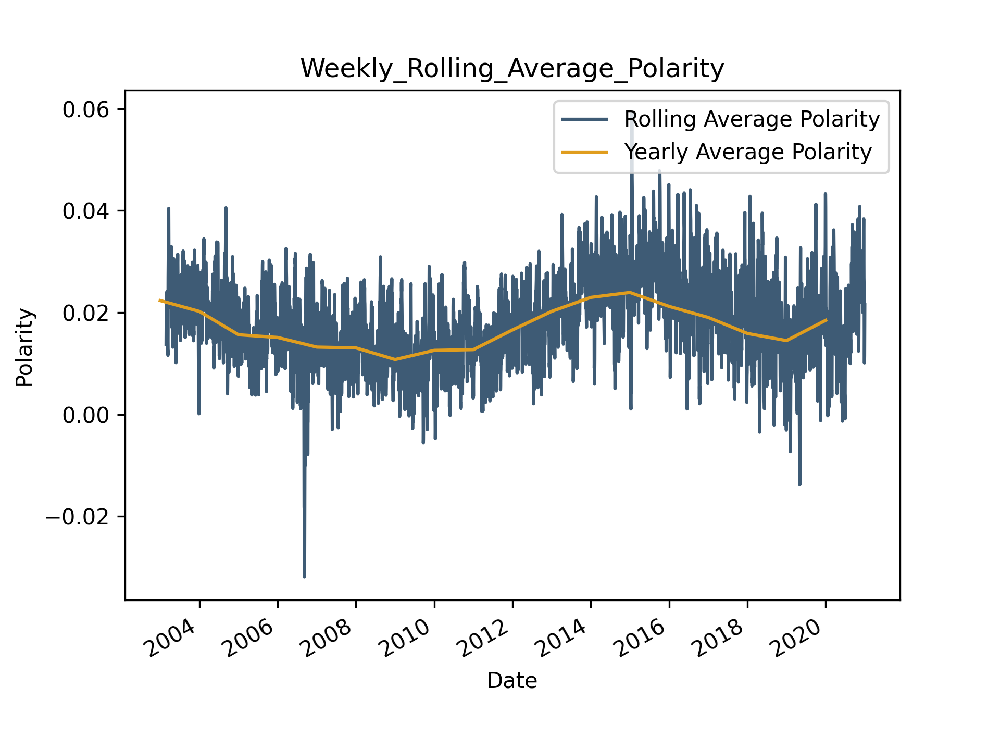
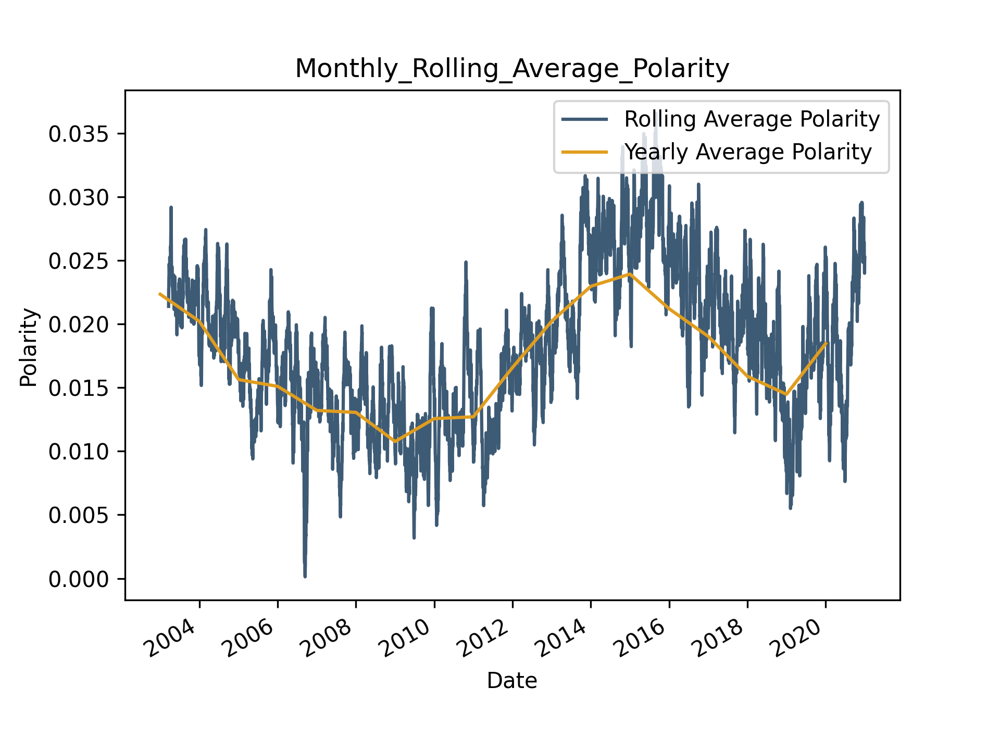

# A3 – Sentiment Analysis: Polarity in Headlines

# Overview 

**Jakob Grøhn Damgaard, May 2021** <br/>
This folder contains  assigmnent 3 for the course *Language Analytics*

# Description
For this assignment, we were tasked with performing dictionary-based sentiment analysis. Dictionary-based sentiment analysis is one of the simplest computational approaches to sentiment analysis and relies on cross-referencing the words in a text with a human-rated sentiment dictionary for calculating sentiment scores. NLP based sentiment analysis aims to identify and quantify the sentiment (often either positive, negative or neutral but can be extended to various moods) carried in a text (Feldmann, 2013).<br>
<br>
For the analysis, we were provided with a data set of one million news headlines from Australian news media *ABC News* collected between 2003 and 2020. This data is already in folder (see *Usage*) but can also be found and downloaded from here: https://www.kaggle.com/therohk/million-headlines
<br>
<br>
 The assignment required us to create and save a plot of sentiment over time with a 1-month rolling average and a plot of sentiment over time with a 1-month rolling average with clear labels, legends etc.. Furthermore, a paragraph containing a brief discussion of the resulting trends should be phrased. In order to increase the quality of the plots, I decided to overlay a 1-year polarity average line plot on both plots to highlight the broader developments.

# Usage
See *General Instruction* in the home folder of the repository for instruction on how to clone the repo locally.
<br>
If not already open, open a terminal window and redirect to the home folder of the cloned repository (see General Instruction). Remember to activate the virtual environment. Then, jump into the folder called A3-Sentiment-Analysis using the following command:

```bash
cd A3-Sentiment-Analysis
```
Now, it should be possible to run the following command in to get an understanding of how the script is executed and which arguments should be provided:

```bash
# Add -h to view how which arguments should be passed  
python3 src/A3-Sentiment-Analysis.py -h
usage: A3-Sentiment-Analysis.py [-h] [-fn --filename] [-dd --data_directory]

[INFO] Sentiment Analysis on a Million Headlines

optional arguments:
  -h, --help            show this help message and exit
  -fn --filename        [DESCRIPTION] The name of the input data file 
                        [TYPE]        str 
                        [DEFAULT]     abcnews-date-text_subset.csv 
                        [EXAMPLE]     -fn abcnews-date-text_subset.csv 

```
<br>
The script can now be executed with the same output using either of the following commands:

```bash

# No arguments passed - the script reverts default values
python3 src/A3-Sentiment-Analysis

# With command line arguments given - same as default values
python3 src/A3-Sentiment-Analysis -fn abcnews-date-text_subset_subset.csv

```

As executing the script on the full one million headlines is rather time consuming, I have included a subset of only the first 200.000 headlines in the *data* folder. This is the file that the script sets as its default input file. If you instead wish to run the script on the entire corpus (and generate the plots shown in the *results* section), feel free to execute the following command:

```bash

python3 src/A3-Sentiment-Analysis -fn abcnews-date-text.csv

```

## Structure
The structure of the assignment folder can be viewed using the following command:

```bash
tree -L 2
```

This should yield the following graph:

```bash
.
├── README.md
├── data
│   ├── abcnews-date-text.csv
│   └── abcnews-date-text_subset.csv
├── output
│   ├── Monthly_Rolling_Average_Polarity.png
│   └── Weekly_Rolling_Average_Polarity.png
└── src
    └── A3-Sentiment-Analysis.py

```

The following table explains the directory structure in more detail:
<br>

| Column | Description|
|--------|:-----------|
```data```| A folder containing the raw data used for the assignment.  This folder includes the full data set *abcnews-date-text.csv* and and a subset called *abcnews-date-text_subset.csv* which contains the first 200.000 headlines.
```src``` | A folder containing the source code (*A3-Sentiment-Analysis.py*) created to solve the assignment. 
```output``` |A folder containing the output produced by the Python script. The script yields two time series plots showing the development in mean headline polarity: <br> •	*Weekly_Rolling_Average_Polarity.png*: Shows the weekly rolling average <br> •	*Monthly_Rolling_Average_Polarity.png*: Shows the monthly rolling average


# Methods
Akin to the script in assignment 2, the script is coded using the principles of object-oriented programming. See the first paragraph of the *A2-Collocation* methods section for a quick outline of the general script architecture. <br>
<br>
The script employs the pipeline component *spaCyTextBlob* from the *spaCy* (Honnibal & Montani, 2017) library built on *TextBlob* (Loria, 2018) for the sentiment analysis. After calculating polarity scores for the individual headlines, polarity is grouped and averaged for every day and every year, respectively. Rolling averages are then calculated over a 7 and a 30 day interval and used for drawing two *Matplotlib* (Hunter, 2007) time series plots. These are, lastly, saved to the output folder. 

# Discussion of Results
<br>
<br>

<br>
<br>

<br>
<br>
It is difficult to draw any major conclusions or inferences, when eyeballing the plots displaying the rolling weekly and monthly averages in headline polarity scores (see figure 2). However, the plots display a slight dip in average scores during the first decaded which is subsequently followed up by a steady increase starting around 2010. It could be speculated that this rise may be a result of a surge in use of social media. The prevalence of these platforms may have pushed news media towards the use of more sensational headlines. It would have been highly interesting to analyse data for the remainder of 2020 to study the potential impacts of the COVID-19 pandemic. On a final note, it is worth mentioning that, with the exception of a few sporadic dips in the weekly rolling average-plot, the mean polarity scores remain positive across the entire period. This is perhaps in contrast to the general view of media always broadcasting bad news.

# References
Feldman, R. (2013). Techniques and applications for sentiment analysis. Communications of the ACM, 56(4), 82-89.
<br>
<br>
Honnibal, M., & Montani, I. (2017). spaCy 2: Natural language understanding with Bloom embeddings, convolutional neural networks and incremental parsing.
<br>
<br>
Hunter, J. D. (2007). Matplotlib: A 2D graphics environment. IEEE Annals of the History of Computing, 9(03), 90-95.
<br>
<br>
Loria, S. (2018). textblob Documentation. Release 0.15, 2.
<br>

# License
Shield: [![CC BY-SA 4.0][cc-by-sa-shield]][cc-by-sa]

This work is licensed under a
[Creative Commons Attribution-ShareAlike 4.0 International License][cc-by-sa].

[![CC BY-SA 4.0][cc-by-sa-image]][cc-by-sa]

[cc-by-sa]: http://creativecommons.org/licenses/by-sa/4.0/
[cc-by-sa-image]: https://licensebuttons.net/l/by-sa/4.0/88x31.png
[cc-by-sa-shield]: https://img.shields.io/badge/License-CC%20BY--SA%204.0-lightgrey.svg

