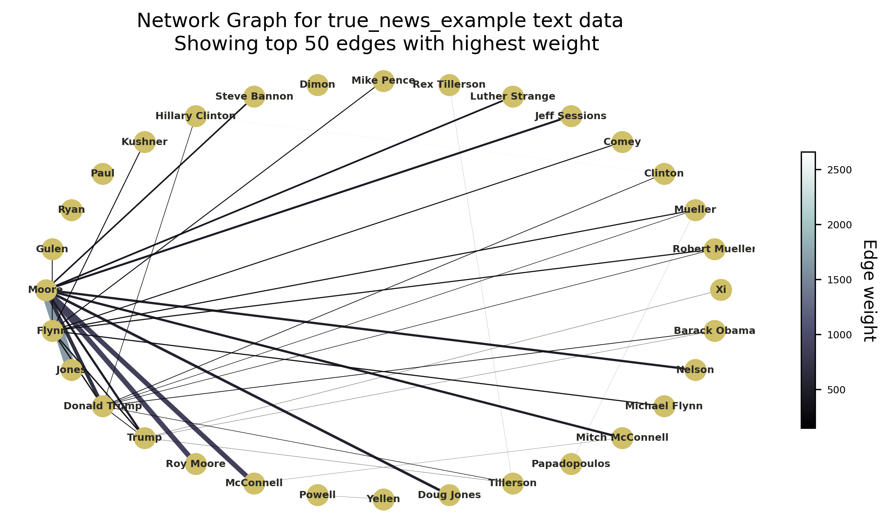
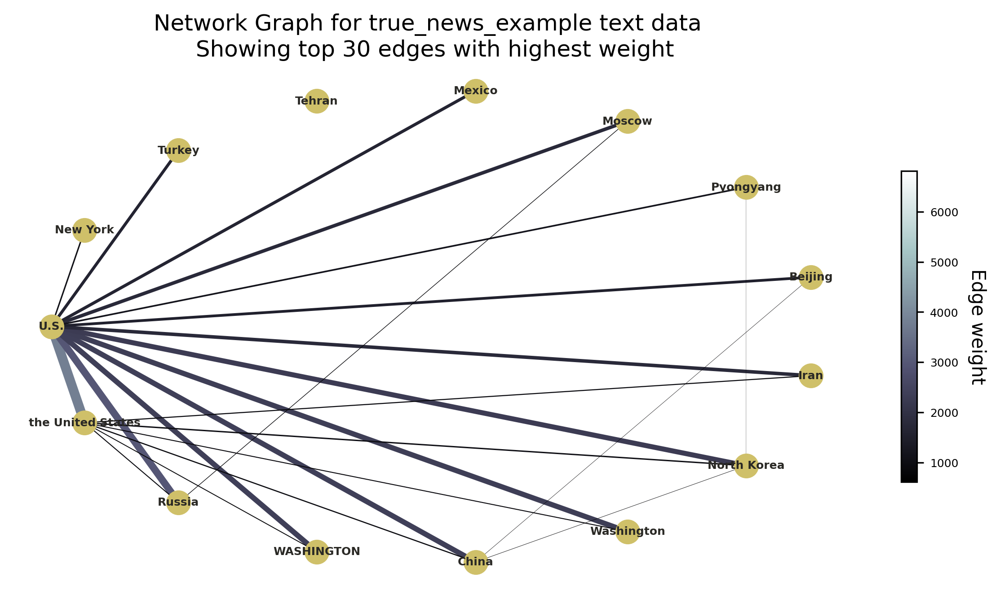

# A4 – Network Analysis from Entity Co-occurrences

# Overview 

**Jakob Grøhn Damgaard, May 2021** <br/>
This folder contains  assigmnent 4 for the course *Language Analytics*

# Description
Network analysis refers to set of domain-agnostic methods for investigating the structure of relationships between object, places, or people. The approach is used across a plethora of fields, from mathematics and physics to social science and geospatial research. A network consists of nodes (representing the objects/people/places being analysed) that are connected by so called edges (representing the inter-node relationships) (Scott, 1988). A proper visualisation of a network graph often provides great insight into the relationships that are being examined, however, numerous metrics to quantify these relationships and structures can also beneficially be calculated. <br>
<br>
For this assignment, we were tasked with producing a stand-alone script capable of taking any weighted edgelist in a *.csv file format* (column headers ‘nodeA’, ’nodeB’, ‘weight’) and creating and saving a network visualization based on this file. Furthermore, the script should generate and output a data frame showing the degree, betweenness, and eigenvector centrality scores for each node. As a bonus challenge, and since this course revolves around language analysis, I decided to add an extra feature enabling the user to perform a network analysis from scratch based on entity co-occurrences in a corpus of documents. More specifically, in addition to taking a pre-made edge list file, the script is able to take a *.csv file* containing a list of text documents, extract a user-defined category of entities from these texts using NER and then generate an edgelist based on entity co-occurrences in the documents. As an example-case, I will use a data set of political news articles from the US to analyse the relationships between people mentioned in these articles based on article co-mentions. The data is obtained from this link. 
https://www.kaggle.com/clmentbisaillon/fake-and-real-news-dataset?select=True.csv  <br>

# Usage
See *General Instruction* in the home folder of the repository for instruction on how to clone the repo locally.
<br>
If not already open, open a terminal window and redirect to the home folder of the cloned repository (see General Instruction). Remember to activate the virtual environment. Then, jump into the folder called *A4-Network-Analysis* using the following command:

```bash
cd A2-Collocation
```

Now, it should be possible to run the following command in to get an understanding of how the script is executed and which arguments should be provided:

```bash
# Add -h to view how which arguments should be passed  
python3 src/A2-Network-Analysis.py -h

usage: A4-Network-Analysis.py [-h] [-tf --text_file] [-ef --edge_file]
                              [-id --identifier] [-ne --n_edges] [-tg --tag]

[INFO] Network Analysis of Entity Co-occurrences

optional arguments:
  -h, --help        show this help message and exit
  -tf --text_file   [DESCRIPTION] The name of the input text file 
                    [TYPE]        str 
                    [EXAMPLE]     -tf true_news.csv 
  -ef --edge_file   [DESCRIPTION] The name of the input edge_file 
                    [TYPE]        str 
                    [EXAMPLE]     -fn edges_df.csv 
  -id --identifier  [DESCRIPTION] Prefix for output files to identify files 
                    [TYPE]        str 
                    [EXAMPLE]     -id true_news 
  -ne --n_edges     [DESCRIPTION] The number of edges to keep in the network. 
                    [TYPE]        int 
                    [DEFAULT]     50 
                    [EXAMPLE]     -ne 50 
  -tg --tag         [DESCRIPTION] Which entities to extract (LOC, PERSON, ORG) 
                    [TYPE]        str 
                    [DEFAULT]     PERSON 
                    [EXAMPLE]     -tg PERSON


```
<br>
As can be seen from this help guide, the script can take several arguments. If no arguments are specified, the script loads in the example edgelist file, *edges_df.csv, which is located in the *data/edge_files* folder. The number of edges to keep is set to 50 and the script is instructed by default to extract entities with the tag ‘PERSON’. The output identifier label is set as the name of the given edgelist file (in this case *edges_df*).<br>
<br>
Baseline execution of the script using the example edgelist file (generated in the notebook from class 6) can be performed using the following command line:

```bash

python3 src/A4-Network-Analysis.py

```

And this yields the same results as the following command:

```bash

python3 src/A4-Network-Analysis.py -ef edges_df.csv -id edges_df -ne 50 -tg PERSON

```

I highly recommend also testing the scripts full functionality by providing it with a raw text data set (*csv* file must contain a column with the header ‘text’). An example data set is located in the *data/text_file*s directory. The full dataset, *true_news.csv*, comprises more than 21.000 articles and, consequently, NER tagging takes a long time when passing this data. Thus, I recommend trying the script on *true_news_example.csv* which only contains a subset of 1.000 articles. The output discussed in the Results section is generated by running the following command:

```bash

python3 src/ A4-Network-Analysis.py -tf true_news_example.csv -ne 50 -tg PERSON

```

Feel free to play around with the -ne and the -tg parameters to create different plots (see *spaCy* (Honnibal & Montani, 2017) documentation for full list of tag categories).

## Structure
The structure of the assignment folder can be viewed using the following command:

```bash
tree -L 2
```

This should yield the following graph:

```bash
.
├── README.md
├── data
│   ├── edge_files
│   └── text_files
├── output
│   ├── edges_df_centrality_df.csv
│   └── true_news_example_centrality_df.csv
├── src
│   └── A4-Network-Analysis.py
└── viz
    ├── edges_df_network_graph.png
    └── true_news_example_network_graph.png

```

The following table explains the directory structure in more detail:
<br>

| Column | Description|
|--------|:-----------|
```data```| A folder containing the data that can be passed as input arguments to the main scripts: <br> •	*edge_files*: This subfolder contains all *.csv edgelist files* (also output directory for edge file created by script) <br> •	*text_files*: This subfolder contains raw text data sets in *.csv* format
```src``` | A folder containing the source code (*A4-Network-Analysis.py*) created to solve the assignment. 
```output``` | An output folder in which the generated data frame containing centrality metrics for the nodes is saved <br> •	*edges_df_50_person_centrality_df.csv*: Centrality scores generated from edges_df.csv edgelist <br> •	*true_news_example_50_person_centrality_df.csv*: Centrality scores when running the script on the true_news_example.csv data with ‘PERSON’ set as tag <br> •	*true_news_example_30_gpe_centrality_df.csv*: Centrality scores when running the script on the true_news_example.csv data with ‘GPE’ set as tag and only the top 30 edges kept
```viz``` | An output folder for the generated network visualisations: <br> •	*edges_df_50_person_network_graph.png*: Network visualisation created from edges_df.csv edgelist <br> •	*true_news_example_50_person_network_graph.png*: Network visualisation created when running the script on the true_news_example.csv data with the ‘PERSON’ set as tag <br> •	*true_news_example_30_gpe_network_graph.png*: Network visualisation created when running the script on the true_news_example.csv data with ‘GPE’ set as tag and only the top 30 edges kept


# Methods
Akin to the script in assignment 2, the script is coded using the principles of object-oriented programming. See the first paragraph of the A2-Collocation methods section for a quick outline of the general script architecture. <br>
<br>
The script is highly dependent on the type of input file. <br>
If the user passes a raw text data set, the script is set to perform the natural language processing steps needed for calculating document cooccurrence weights for a designated category of entities. Firstly, the desired entities are extracted for each document in input file using the *spaCy* library (Honnibal & Montani, 2017) for named entity recognition. By default, the module extracts names of people and these people are what the nodes in the final network represent. However, this can be adjusted by the user (see *Usage*). For analyses of e.g., international diplomatic relationships via a corpus of United Nations documents, setting the tag to *GPE* would allow for the extraction of countries, cities, and states etc. If one had a corpus of football transfer rumour tweets, then setting the tag to *ORG* may enable insight into the trade connections between major European football clubs. When entities have been extracted for each document, all combinations of entity pairs that are mentioned together for each document is calculated and the frequencies of these pairs across the entire corpus are calculated. This co-mention frequency represents the weight of the edge that can be drawn between these two nodes (the two entities in the pair). The found edge weights for all node pairs are then combined into a single edgelist data frame using Pandas (McKinney et al., 2010) which can be used for visualising a network graph and calculating centrality scores.
If, instead, a pre-made edgelist file is passed to the script, the previous steps are skipped and the script directly loads in the edge list. A network graph is then generated using the NetworkX (Aric et al., 2008) and Matplotlib (Hunter, 2007) libraries. The graph is drawn using a shell layout which scatters the nodes around a circle. In my opinion, this provides a neat and manageable network layout with minimal overlapping and from which is easy to locate nodes of high relevance. Two provide more details on the strength of the relationships in the network the widths of the edges are weighted according the ‘weight’ column in the edge list (number of document-cooccurrences). Likewise, the colours of the edges are also determined by this attribute. Adding both these visual features to the plot may be excessive, however, they neatly display the options one has when generating network visualisations.  The user I also able to adjust the number of edges with the highest weights they whish to keep in the plot (too many insignificant edges spoil the plot). This is more generalisable and easier to manage than setting a minimum weight threshold in my opinion.  Finally, the three requested centrality measures for each of the nodes are calculated and bundled into a data frame and saved to the output folder.


# Results
The script fulfills the task objectives described in the Description and can be flexible used by the user from the command line. Following plot shows the network graph generated when running the script with the following arguments:

```bash

python3 src/ A4-Network-Analysis.py -tf true_news_example.csv -ne 50 -tg PERSON

```

<br>

<br>
<br>
The next plot shows the network graph generated when running the script with the following arguments:
<br>

<br>
<br>
The title of the plot is adjusted according to the input arguments. Due to the possibility of errors and problems when installing and using the *Pygraphviz* package, I purposefully refrained from employing *NetworkX* graph layouts dependent on this package. This limited the number of possible plotting layouts.<br>
<br>
Though the script works as intended, the network visualisation in the first graph reveals a minor problem. The first mention of a person in an article, often includes the full name. However, when this person is referred later in article, it is common practice to only mention the surname. Thus, the script interprets these two names as separate entities and creates two nodes even though they represent the same person (exemplified by strong connection between *Moore* and *Ryan Moore* nodes). Similarly, the final graph shows that many places can referred to using different names, e.g. *the United States* and *U.S.*. The script could, hence, be improved to take account for these node overlaps by using more complex NLP methods to identify and collapse entities that refer to the same concept/object/person.


# References
Aric A. Hagberg, Daniel A. Schult and Pieter J. Swart, “Exploring network structure, dynamics, and function using NetworkX”, in Proceedings of the 7th Python in Science Conference (SciPy2008), Gäel Varoquaux, Travis Vaught, and Jarrod Millman (Eds), (Pasadena, CA USA), pp. 11–15, Aug 2008
<br>
<br>
Honnibal, M., & Montani, I. (2017). spaCy 2: Natural language understanding with Bloom embeddings, convolutional neural networks and incremental parsing.
<br>
<br>
Hunter, J. D. (2007). Matplotlib: A 2D graphics environment. IEEE Annals of the History of Computing, 9(03), 90-95.
<br>
<br>
McKinney, W., & others. (2010). Data structures for statistical computing in python. In Proceedings of the 9th Python in Science Conference (Vol. 445, pp. 51–56).
<br>
<br>
Scott, J. (1988). Social network analysis. Sociology, 22(1), 109-127.

# License
Shield: [![CC BY-SA 4.0][cc-by-sa-shield]][cc-by-sa]

This work is licensed under a
[Creative Commons Attribution-ShareAlike 4.0 International License][cc-by-sa].

[![CC BY-SA 4.0][cc-by-sa-image]][cc-by-sa]

[cc-by-sa]: http://creativecommons.org/licenses/by-sa/4.0/
[cc-by-sa-image]: https://licensebuttons.net/l/by-sa/4.0/88x31.png
[cc-by-sa-shield]: https://img.shields.io/badge/License-CC%20BY--SA%204.0-lightgrey.svg

