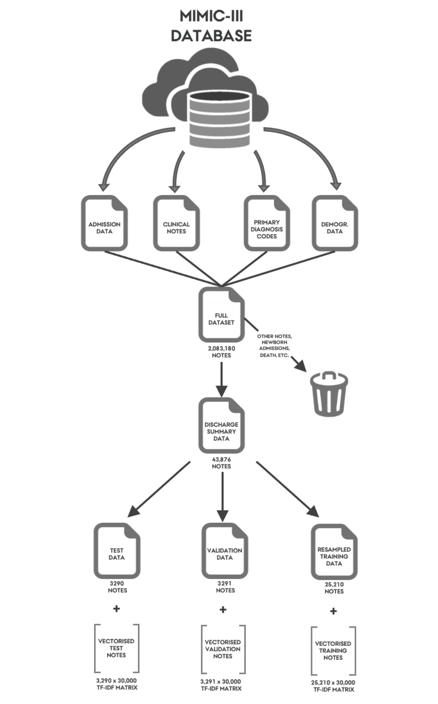
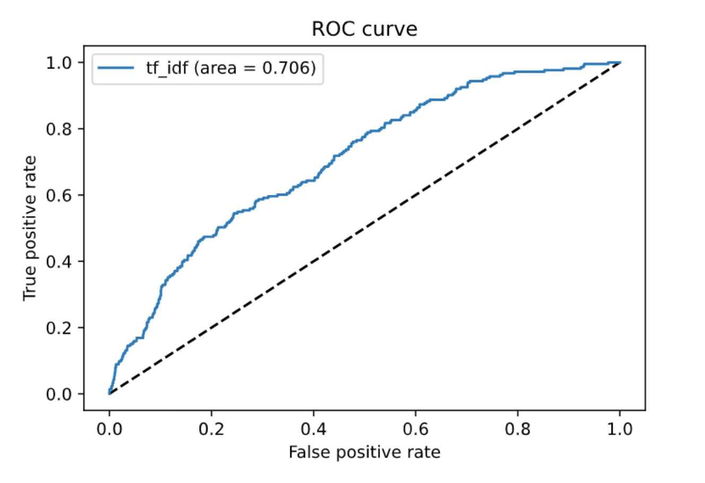

# W10 - Supervised Learning 

**Jakob Grøhn Damgaard, April 2021**  
This repository contains the W10 assigmnent for the course *Language Analytics*

# Predicting Unplanned Readmissions using Clinical Discharge Notes 

## Overview 
Digitalisation of health data documentation has caused a drastic increase in the amounts of electronic health records (EHRs) available for quantitative modelling. Combined with modern deep learning techniques, EHRs can be exploited to generate data driven tools for prediction and intervention in clinical health care settings (Jensen et al., 2012; Shickel et al., 2017). However, a majority of the stored data is in the form of unstructured, prosaic clinical notes. Extracting the valuable information embedded in these notes has proved highly challenging due their chaotic and sparse nature (Dubois et al., 2017).  
 
In this study, I attempt to predict unplanned readmissions (within 30 days of discharge) of patients admitted to an intensive care unit using discharge notes written by nurses and physicians at the time of discharge as input to an artificial feed-forward neural network. These notes contain a brief (~1000 words) summary of the hospitalisation and contain crucial qualitative information about patients that exceed what can be stored in structured data tables; expert insights, elaborations on procedures and symptoms and descriptions of social history. The notes are preprocessed and converted to feature representations using TF-IDF vectorisation. Subsequently, readmission labels are predicted.   
 
One study estimates that expenses for unplanned readmissions yearly exceed $17 billion in the US alone (Jencks et al., 2009) while another concluded that, on average, 27% of unplanned readmissions are avoidable (van Walraven et al., 2011). Preventing such readmissions may help improve the quality of life for affected patients (Anderson & Steinberg, 1984) and prevent lives from being prematurely lost. It is evident that creating a tool which accurately foresees high readmission risk in patients may have positive implications for both patients, clinicians and in cost efficiency. The 30-day time window is a common measure in unplanned readmission prediction (Kansagara et al., 2011). 
 
Following flowchart displays the preprocessing steps from the raw data input to the final cleaned training, testing and validation data sets. Several seperate datasets must be merged in order to create a dataset with meaningful readmission labels. The training data set is used to train the final classification model. The validation dataset is used to explore which neural network structure yields the highest possibel AUC-ROC score (automated hyperband search (Li et al., 2016) performed using kerastuneR package - this script is not included in this repository). This exploration found that a simple, single layered network with a binary sigmoid output node (akin to logistic regression) provided the best results. After training, the predictive performance of the model is tested using the test set. See the *data_preprocessing.py* script for the full preprocessing workflow and comments on the decisions made througout the process.

## MIMIC-III Dataset
Electronic health records were obtained from the MIMIC-III database (Johnson et al., 2016) and the required data files were retrieved from PhysioNet (Goldberger et al., 2000). The MIMIC-III database is a freely accessible health-data resource which contains an extensive range of both structured and unstructured de-identified data from intensive care admissions of more than 40.000 patients at the Beth Israel Deaconess Medical Center between 2001 and 2012. It comprises detailed information on demographics, test results, free-text clinical notes written by caregivers and ICD-9 procedure and diagnosis codes among others. The clinical notes dataset, which constitutes the foundation of the model exploration in this paper, comprises 2,083,180 human-written notes. The final cleaned discharge notes data used for training, validation and testing comrpise 43,876 notes.

## Code
The code to used to perform the initial preprocessing of the data can be found in the *data_preprocessing.py* script 
Code for the supervised logistic regression classifier can be found in the *readmission_prediction.py* script 

## Results
The logistic regression classifier trained on raw TF-IDF vectors yields an AUC-ROC of 0.706, recall of 0.556 and a precision of 0.123 and overall accuracy of 0.71. As the test data (and real world scenarios) are highly imbalanced and contain very few positive instances, it is not meaningful to interpret the overall accuracy. Model prediction performance is mainly evaluated using the AUC-ROC score. This is the primary evaluation metric of many other readmission prediction publications (Rajkomar et al. 2018, Craig et al., 20177) and, hence, enables for convenient model comparisons. The score is designed to measure how well a model discriminates between positive and negative instances (Fawcett, 2006). As it is insensitive to class imbalance, it is regularly used when dealing with skewed data in binary prediction where basic accuracy evaluation would be worthless (Jeni et al., 2013).   
 
The performance results may appear weak at first peek but one must keep in mind that this is a classification task that is impossible to perfect. Though many readmissions are potentially avoidable, most are intrinsically spontaneous and impossible to foresee without the aid of a quantum-precise mapping of the universe. 
Generally, the model performs similarly to related work on predicting unplanned readmissions using discharge summaries; Craig et al. (2017) report an AUC-SCORE of 0.71.
 
The graph below shows the AUC-ROC curve for the classifier:

## Future development
It would be interesting to extract the most impactful tokens from the input layer to the logistic regression classifier to examine which words are important for predicting readmission. Is it medicine dosages or perhaps symptoms that are the most significant indicators of readmission?

## Download and Execute
Unfortunately, the MIMIC-III is restricted and access to the data requires authorisation. Therefore, I am unable to share the data publicly in the folder and the code is, thus, not runnable on your machine. Please read through the code using the commenting as assistance for understanding the steps taken to complete the preprocessing and the supervised logistic regression classification model.

## Sources
- Jensen, P. B., Jensen, L. J., & Brunak, S. (2012). Mining electronic health records: Towards better research
applications and clinical care. Nature Reviews Genetics, 13(6), 395–405.
https://doi.org/10.1038/nrg3208  
- Shickel, B., Tighe, P. J., Bihorac, A., & Rashidi, P. (2017). Deep EHR: a survey of recent advances in deep learning techniques for electronic health record (EHR) analysis. IEEE journal of biomedical and health informatics, 22(5), 1589-1604.  
- Dubois, S., Romano, N., Kale, D. C., Shah, N., & Jung, K. (2017). Learning effective representations from clinical notes. stat, 1050, 15.  
- Jencks, S. F., Williams, M. V., & Coleman, E. A. (2009). Rehospitalizations among Patients in the Medicare
Fee-for-Service Program. New England Journal of Medicine, 360(14), 1418–1428.
https://doi.org/10.1056/NEJMsa0803563  
- Van Walraven, C., Bennett, C., Jennings, A., Austin, P. C., & Forster, A. J. (2011). Proportion of hospital readmissions deemed avoidable: a systematic review. Cmaj, 183(7), E391-E402.  
- Anderson, G. F., & Steinberg, E. P. (2010, January 13). Hospital Readmissions in the Medicare Population (world)  Http://Dx.Doi.Org/10.1056/NEJM198411223112105; Massachusetts Medical Society. https://doi.org/10.1056/NEJM198411223112105  
- Johnson, A. E. W., Pollard, T. J., Shen, L., Lehman, L. H., Feng, M., Ghassemi, M., Moody, B., Szolovits, P.,
Anthony Celi, L., & Mark, R. G. (2016). MIMIC-III, a freely accessible critical care database.
Scientific Data, 3. https://doi.org/10.1038/sdata.2016.35  
- Goldberger Ary L., Amaral Luis A. N., Glass Leon, Hausdorff Jeffrey M., Ivanov Plamen Ch., Mark Roger G., Mietus Joseph E., Moody George B., Peng Chung-Kang, & Stanley H. Eugene. (2000). PhysioBank, PhysioToolkit, and PhysioNet. Circulation, 101(23), e215–e220. https://doi.org/10.1161/01.CIR.101.23.e215 
- Rajkomar, A., Oren, E., Chen, K., Dai, A. M., Hajaj, N., Hardt, M., Liu, P. J., Liu, X., Marcus, J., Sun, M.,
Sundberg, P., Yee, H., Zhang, K., Zhang, Y., Flores, G., Duggan, G. E., Irvine, J., Le, Q., Litsch, K., ... Dean, J. (2018). Scalable and accurate deep learning with electronic health records. Npj Digital Medicine, 1(1), 1–10. https://doi.org/10.1038/s41746-018-0029-1  
- Jeni, L. A., Cohn, J. F., & De La Torre, F. (2013). Facing imbalanced data—Recommendations for the use of
performance metrics. 2013 Humaine Association Conference on Affective Computing and Intelligent
Interaction, 245–251. https://doi.org/10.1109/ACII.2013.47  
- Craig, E., Arias, C., & Gillman, D. (2017). Predicting readmission risk from doctors’ notes. ArXiv:1711.10663 [Stat]. http://arxiv.org/abs/1711.10663  
- Fawcett, T. (2006). An introduction to ROC analysis. Pattern Recognition Letters, 27(8), 861–874. https://doi.org/10.1016/j.patrec.2005.10.010  
 
# License
Shield: [![CC BY-SA 4.0][cc-by-sa-shield]][cc-by-sa]

This work is licensed under a
[Creative Commons Attribution-ShareAlike 4.0 International License][cc-by-sa].

[![CC BY-SA 4.0][cc-by-sa-image]][cc-by-sa]

[cc-by-sa]: http://creativecommons.org/licenses/by-sa/4.0/
[cc-by-sa-image]: https://licensebuttons.net/l/by-sa/4.0/88x31.png
[cc-by-sa-shield]: https://img.shields.io/badge/License-CC%20BY--SA%204.0-lightgrey.svg

