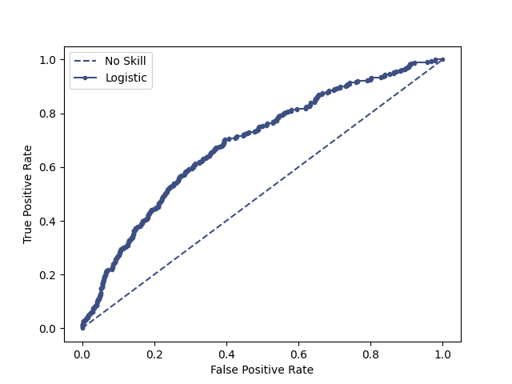
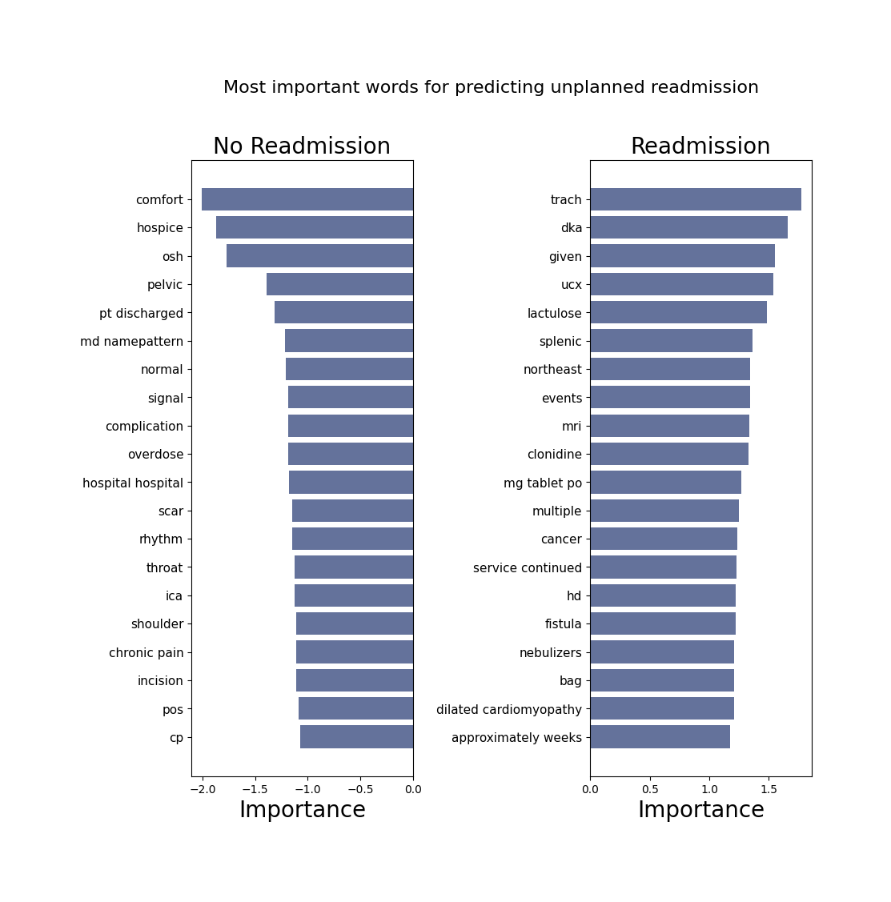

# A5 Supervised Learning - Readmission Prediction from Clinical Discharge Summaries

**Jakob Grøhn Damgaard, May 2021** <br/>
This repository contains the A5 assigmnent for the course *Language Analytics*. I  chose to conduct supervised classification learning

## Overview 
Digitalisation of health data documentation has caused a drastic increase in the amounts of electronic health records (EHRs) available for quantitative modelling. Combined with modern machine learning techniques, EHRs can be exploited to generate data driven tools for prediction and intervention in clinical health care settings (Jensen et al., 2012; Shickel et al., 2017). However, a majority of the stored data is in the form of unstructured, prosaic clinical notes. Extracting the valuable information embedded in these notes has proved highly challenging due their chaotic and sparse nature (Dubois et al., 2017). <br>
<br>
In this study, I attempt to predict unplanned readmissions (within 30 days of discharge) of patients admitted to an intensive care unit using discharge notes written by nurses and physicians at the time of discharge. These notes contain a brief (~1000 words) summary of the hospitalisation and contain crucial qualitative information about patients that exceed what can be stored in structured data tables; expert insights, elaborations on procedures and symptoms and descriptions of social history etc.. The notes are preprocessed and converted to feature representations using TF-IDF vectorisation. Subsequently, readmission labels are predicted using logistic regression. The simple, shallow nature of this algorithm allows me to calculate and visualize the direct influence of the input features. <br>
<br>
One study estimates that expenses for unplanned readmissions yearly exceed $17 billion in the US alone (Jencks et al., 2009) while another concluded that, on average, 27% of unplanned readmissions are avoidable (van Walraven et al., 2011). Preventing such readmissions may help improve the quality of life for affected patients (Anderson & Steinberg, 1984) and prevent lives from being prematurely lost. It is clear that creating a tool which accurately foresees high readmission risk in patients may have positive implications for both patients, clinicians and spending. The 30-day time window is a common measure in unplanned readmission prediction (Kansagara et al., 2011).
<br>

## Data
Electronic health records were obtained from the MIMIC-III database (Johnson et al., 2016) and the required data files were retrieved from PhysioNet (Goldberger et al., 2000). The MIMIC-III database is a freely accessible health-data resource which contains an extensive range of both structured and unstructured de-identified data from intensive care admissions of more than 40.000 patients at the Beth Israel Deaconess Medical Center between 2001 and 2012. It comprises detailed information on demographics, test results, free-text clinical notes written by caregivers and ICD-9 procedure and diagnosis codes among others. The clinical notes dataset, which constitutes the foundation of the model exploration in this paper, comprises 2,083,180 human-written notes. The final cleaned discharge notes data used for training, validation and testing comrpise 43,876 notes.<br> 
<br>
Due to the high sensitivity of the data, the MIMIC-III database is, unfortunately, restricted and access to the data requires authorisation. Therefore, I am unable to share the data publicly in the folder and the code is, thus, not runnable on your machine. Please read through the code using the commenting as assistance for understanding the steps taken to complete the preprocessing and the supervised logistic regression classification model. Everyone is free to apply for access to the data from PhysioNet but the process is lengthy:<br>
https://mimic.mit.edu/iii/gettingstarted/


## Usage
**If one has access to the correct data in the data folder, executing the files could be carried out like this:**
<br>
<br>
If not already open, open a terminal window and redirect to the home folder of the cloned repository (see General Instruction). Remember to activate the virtual environment. Then, jump into the folder called A5-Supervised-Learning using the following command:

```bash
cd A5-Supervised-Learning
```

Now, it should be possible to run the following command in to get an understanding of how the data pre-processing script is executed and which arguments should be provided:

```bash
# Add -h to view how which arguments should be passed  
python3 src/data_preprocessing.py -h    
usage: data_preprocessing.py [-h] [-nf --notes_file] [-af --admissions_file] [-mf --max_features] [-ng --ngram_range]

[INFO] Pre-processing discharge summaries

optional arguments:s
  -h, --help            show this help message and exit
  -nf --notes_file      [DESCRIPTION] The path for the file containing clinical notes. 
                        [TYPE]        str 
                        [DEFAULT]     NOTEEVENTS.csv 
                        [EXAMPLE]     -ne NOTEEVENTS.csv
  -af --admission_file  [DESCRIPTION] The path for the file containing general admissions data 
                        [TYPE]        str 
                        [DEFAULT]     ADMISSIONS.csv 
                        [EXAMPLE]     -ne ADMISSIONS.csv 
  -mf --max_features    [DESCRIPTION] The number of features to keep in the vectorised notes 
                        [TYPE]        int 
                        [DEFAULT]     30000 
                        [EXAMPLE]     -mf 30000 
  -ng --ngram_range     [DESCRIPTION] Defines the range of ngrams to include (either 2 or 3) 
                        [TYPE]        int 
                        [DEFAULT]     3 
                        [EXAMPLE]     -ng 3

```
<br>
By letting the script use the default inputs, it can be executed like this:

```bash

python3 src/data_preprocessing.py

```

This outputs vectorised training, test and validation data along with classification labels (vector of 0 or 1s) and the vocabulary obtained when fitting the vectorised.<br>
<br>
This data allows one to run the *readmission_prediction.py*. First, let us examine which arguments the script takes: 

```bash
# Add -h to view how which arguments should be passed  
python3 src/readmission_prediction.py -h
usage: readmission_prediction.py [-h] [-tr --train_data] [-te --test_data]
                                 [-trl --train_labels] [--tel --test_labels]

[INFO] Readmission Prediction

optional arguments:
  -h, --help           show this help message and exit
  -tr --train_data     [DESCRIPTION] The file name of the training data csv 
                       [TYPE]        str 
                       [DEFAULT]     tfidf_train_notes.csv 
                       [EXAMPLE]     -tr tfidf_train_notes.csv 
  -te --test_data      [DESCRIPTION] The file name of the test data csv 
                       [TYPE]        str 
                       [DEFAULT]     tfidf_test_notes.csv 
                       [EXAMPLE]     -tr tfidf_test_notes.csv 
  -trl --train_labels  [DESCRIPTION] The file name of the training labels csv
                       [TYPE]        str 
                       [DEFAULT]     train_labels.csv 
                       [EXAMPLE]     -tr train_labels.csv 
  --tel --test_labels  [DESCRIPTION] The file name of the test labels csv
                       [TYPE]        str 
                       [DEFAULT]     test_labels.csv 
                       [EXAMPLE]     -tr test_labels.csv 

```
Readmission prediction can now be performed using the following command:

```bash

python3 src/readmission_prediction.py

```
As the *NOTEEVENTS.csv* data file loaded in to the first script exceeds 4GB in storage, the script take around 15 minutes to execute on my MacBook.

## Structure
The structure of the assignment folder can be viewed using the following command:

```bash
tree -L 2
```

This should yield the following graph:

```bash
.
├── README.md
├── data
│   ├── ADMISSIONS.csv
│   └── NOTEEVENTS.csv
├── output
│   ├── test_labels.csv
│   ├── tfidf_test_notes.csv
│   ├── tfidf_train_notes.csv
│   ├── tfidf_valid_notes.csv
│   ├── train_labels.csv
│   ├── valid_labels.csv
│   └── vocab
├── src
│   ├── data_preprocessing.py
│   └── readmission_prediction.py
└── viz
    ├── ROC-AUC.png
    ├── most_important.png
    └── preprocessing.png

```

The following table explains the directory structure in more detail:
<br>

| Column | Description|
|--------|:-----------|
```data```| A folder containing the raw data that can be passed as input arguments to the preprocessing script: <br> •	ADMISSIONS.csv: This file contains all information and metadata on admissions <br> •	NOTEEVENTS.csv: This file contains all clinical notes written during all admissions <br>
```src``` | A folder containing the source code (*readmission_prediction.p*y and *data_preprocessing.py*) created to solve the assignment. 
```output``` | An output folder in which the generated data frames containing vectorised notes, labels and the vocabulary used for matching influential features with their tokens <br> •	*.csv* files: Vectorised notes and labels for test, train and validation splits <br> •	*vocab*: This subfolder holds the vocabulary *vocabulary.pkl*
```viz``` | An output folder for the generated visualisations and other visualisations for the README.md file <br> •	*ROC-AUC.png*: Image of AUC-ROC curve <br> •	*most_important.png*: Image showing the most influential features and the weigths <br> •	*preprocessing.png*: Flowchart of the preprocessing pipeline


## Methods
The figure below displays the preprocessing steps from the raw data input to the final cleaned training, testing and validation data sets. This process from loading the raw data set to saving cleaned, split, vectorised data with appertaining labels is all performed in the *data_preprocessing.py* script. The script relies on the libraries Numpy (Harris et al., 2020) and Pandas (McKinney et al., 2010) for data handling and transformations, nltk (Bird et al., 2009) for string processing and scikit-learn (Pedregosa et al., 2011) for TF-IDF vectorization.<br>
Raw data on admissions (time, type etc.) and a .csv file containing the clinical notes are taken as input. All admissions with an associated discharge summary were retained and all notes except discharge summaries were discarded. For faulty instances with multiple discharge summaries, the note written first was kept. Admissions lacking a discharge summary (~3.9%) as well as 12 patients with overlapping admissions were removed. To preserve homogeneity in the dataset, 7863 neonatal admissions were also removed. Lastly, all admissions resulting in patient death were removed. The preprocessing is structured as follows:
<br><br>

1.	Admission data is preprocessed and cleaned
2.	Discharge summaries are extracted and preprocessed
3.	Data frames are merged
4.	Data is split into test (10%), validation (10%) and train (80%) sets
5.	Training data is balanced by oversampling positive instances with a factor of 5 and then down-sampling negative instances to adjust. The general data is highly class-imbalanced and under 4% of cases lead to unplanned readmissions
6.	Labels are extract and notes are TF-IDF vectorised and everything is saved to output folder

<br><br>
The training data set is used to train the final classification model. The validation dataset is used to manually explore which feature parameters during vectorization and hyperparameters in the logistic regression yield the highest possibel AUC-ROC score. The test set is kept completely hidden from the model until final performance evaluation to avoid bias. After manually testing classification performance on the validation set, the optimal number of max number of features to keep when vectorizing the notes was 30.000 (max_df = 0.8). A custom tokenizer function was designed to remove numbers and punctuation before tokenization. All English stop-words were further removed. Many medical terms are composed of multiple, conjoining words, e.g. congestive heart failure. Thus, to capture these word codependencies, notes were tokenized into both uni-, bi- and trigrams (also found to perform best with validation data). <br> <br>
The TF-IDF vectorised notes and classification labels output by the preprocessing script are taken as inputs to the *readmission_prediction.py* script. This script trains a scikit-learn based logistic regression classification model and tests its performance at predicting readmission on the test data set. The model uses l2 regularization and a default tolerance of 0.0001. The script prints a classification report in the terminal window and generates a plot of the AUC-ROC plot which it saves in the viz folder. Lastly, the script calculates the top 20 features that drive the model most towards a negative prediction (no unplanned readmission) and positive prediction (unplanned readmission), respectively.<br>
<br>


## Results
The logistic regression classifier trained on raw TF-IDF vectors yields an AUC-ROC of 0.698, a macro average recall of 0.62 and a macro average precision of 0.55 and overall accuracy of 0.78. As the test data (and real world scenarios) are highly imbalanced and contain very few positive instances, it is not meaningful to interpret the overall accuracy. AUC-ROC score is the main metric used for evaluation as this is the primary evaluation metric of many other readmission prediction publications (Rajkomar et al. 2018, Craig et al., 2017) and, therefore, it enables for convenient model comparisons. The score is designed to measure how well a model discriminates between positive and negative instances (Fawcett, 2006). As it is insensitive to class imbalance, it is regularly used when dealing with skewed data in binary prediction where basic accuracy evaluation would be worthless (Jeni et al., 2013). Despite its highly simple nature, the classifier performs similarly to other work aimed at predicting unplanned readmissions using discharge summaries; Craig et al. (2017) reports an AUC-ROC score of 0.71. The plot below shows the AUC-ROC curve for the classifier. <br>
<br>

<br>
<br>
As stated in the description, the shallow architecture of logistic regression classification makes it easy to analyse of the influence of the individual input features. This helps guide model optimisation and increases transparency; understanding how the model derives its predictions is a crucial - especially in clinical settings. The bar plot below shows the input tokens that push the model mostly towards predicting either ‘no readmission’ or ‘unplanned readmission within 30 days’. This visualisation shows some interesting things. It is, for instance, sensible that comfort strongly drives the model towards believing that the patient is not likely to be swiftly readmitted as they are feeling better. In the opposite end of the spectrum, the second word indicates that the patient is about to be transferred to a hospice. This is often a place people are transferred to when active care is no longer possible and death is near and, thus, patients are seldom readmitted hereafter. These results show that the model is capturing patterns/features in the notes that would, to a certain extent, also be influential to a human (perhaps a clinician) making decisions/predictions.
<br>
<br>
 
<br>
<br>
In general, I believe that - if one wishes to maintain a simple model structure - feature parameters are the primary (and the most economical) knobs to turn for improving results. 
A point worth noting, is that using the AUC-ROC as the primary - and effectively stand-alone evaluation metric - is, in my view, highly problematic. The model clearly shows a low precision (expected with highly skewed data), but this is difficult to compare with other research as the measure is seldom reported. For a larger project, I would attempt to include the Matthews correlation coefficient (Chicco & Durman, 2020) for a study similar to this.

## Sources
- Jensen, P. B., Jensen, L. J., & Brunak, S. (2012). Mining electronic health records: Towards better research
applications and clinical care. Nature Reviews Genetics, 13(6), 395–405.
https://doi.org/10.1038/nrg3208 <br/>
- Shickel, B., Tighe, P. J., Bihorac, A., & Rashidi, P. (2017). Deep EHR: a survey of recent advances in deep learning techniques for electronic health record (EHR) analysis. IEEE journal of biomedical and health informatics, 22(5), 1589-1604. <br/>
- Dubois, S., Romano, N., Kale, D. C., Shah, N., & Jung, K. (2017). Learning effective representations from clinical notes. stat, 1050, 15. <br/>
- Jencks, S. F., Williams, M. V., & Coleman, E. A. (2009). Rehospitalizations among Patients in the Medicare
Fee-for-Service Program. New England Journal of Medicine, 360(14), 1418–1428.
https://doi.org/10.1056/NEJMsa0803563 <br/>
- Chicco, D., & Jurman, G. (2020). The advantages of the Matthews correlation coefficient (MCC) over F1 score and accuracy in binary classification evaluation. BMC genomics, 21(1), 1-13 <br>
- Kansagara, D., Englander, H., Salanitro, A., Kagen, D., Theobald, C., Freeman, M., & Kripalani, S. (2011). Risk Prediction Models for Hospital Readmission: A Systematic Review. JAMA, 306(15), 1688– 1698. <br>
- Van Walraven, C., Bennett, C., Jennings, A., Austin, P. C., & Forster, A. J. (2011). Proportion of hospital readmissions deemed avoidable: a systematic review. Cmaj, 183(7), E391-E402. <br/>
- Anderson, G. F., & Steinberg, E. P. (2010, January 13). Hospital Readmissions in the Medicare Population (world)  Http://Dx.Doi.Org/10.1056/NEJM198411223112105; Massachusetts Medical Society. https://doi.org/10.1056/NEJM198411223112105 <br/>
- Johnson, A. E. W., Pollard, T. J., Shen, L., Lehman, L. H., Feng, M., Ghassemi, M., Moody, B., Szolovits, P.,
Anthony Celi, L., & Mark, R. G. (2016). MIMIC-III, a freely accessible critical care database.
Scientific Data, 3. https://doi.org/10.1038/sdata.2016.35 <br/>
- Goldberger Ary L., Amaral Luis A. N., Glass Leon, Hausdorff Jeffrey M., Ivanov Plamen Ch., Mark Roger G., Mietus Joseph E., Moody George B., Peng Chung-Kang, & Stanley H. Eugene. (2000). PhysioBank, PhysioToolkit, and PhysioNet. Circulation, 101(23), e215–e220. https://doi.org/10.1161/01.CIR.101.23.e215<br/>
- Rajkomar, A., Oren, E., Chen, K., Dai, A. M., Hajaj, N., Hardt, M., Liu, P. J., Liu, X., Marcus, J., Sun, M.,
Sundberg, P., Yee, H., Zhang, K., Zhang, Y., Flores, G., Duggan, G. E., Irvine, J., Le, Q., Litsch, K., ... Dean, J. (2018). Scalable and accurate deep learning with electronic health records. Npj Digital Medicine, 1(1), 1–10. https://doi.org/10.1038/s41746-018-0029-1 <br/>
- Jeni, L. A., Cohn, J. F., & De La Torre, F. (2013). Facing imbalanced data—Recommendations for the use of
performance metrics. 2013 Humaine Association Conference on Affective Computing and Intelligent
Interaction, 245–251. https://doi.org/10.1109/ACII.2013.47 <br/>
- Craig, E., Arias, C., & Gillman, D. (2017). Predicting readmission risk from doctors’ notes. ArXiv:1711.10663 [Stat]. http://arxiv.org/abs/1711.10663 <br/>
- Fawcett, T. (2006). An introduction to ROC analysis. Pattern Recognition Letters, 27(8), 861–874. https://doi.org/10.1016/j.patrec.2005.10.010 <br/>
 
# License
Shield: [![CC BY-SA 4.0][cc-by-sa-shield]][cc-by-sa]

This work is licensed under a
[Creative Commons Attribution-ShareAlike 4.0 International License][cc-by-sa].

[![CC BY-SA 4.0][cc-by-sa-image]][cc-by-sa]

[cc-by-sa]: http://creativecommons.org/licenses/by-sa/4.0/
[cc-by-sa-image]: https://licensebuttons.net/l/by-sa/4.0/88x31.png
[cc-by-sa-shield]: https://img.shields.io/badge/License-CC%20BY--SA%204.0-lightgrey.svg

