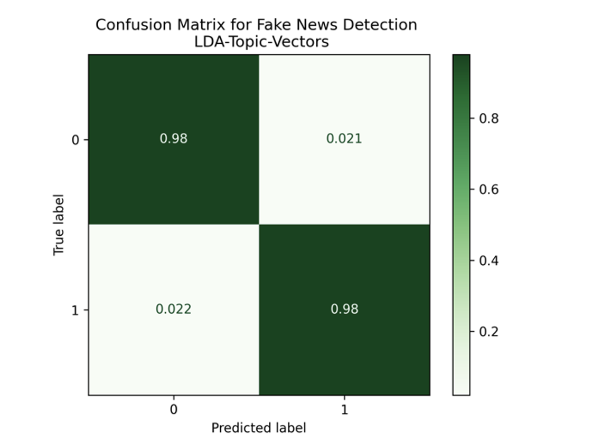

# Self-Assigned: Latent Feature Extraction Using LDA for Text Classification

# Overview 

**Jakob Grøhn Damgaard, May 2021** <br/>
This folder contains the self-assigned assignemnt for the course *Language Analytics*

# Description
The vast majority of all human-generated data comes in the form of unstructured, free-written text; on the internet pages you visit daily, in the books you read at night or in the documents you process at work. However, when represented using classical Bag-of-Word feature representations, long prosaic texts are high-dimensional and extremely sparse, and this makes it difficult to extract only the important information without being flooded by redundant stuff. Trying to model only meaningful features is denounced feature engineering  
and if often the key to good models. A common approach revolves around using NLP techniques to reduce sparsity and capture robust, latent representations of the input texts by transforming them into a lower-dimensional vector space.<br>
<br>
For this self-assignment project, I wish to investigate using Latent Dirichlet Allocation (LDA) as a method for creating dimensionality-reduced latent feature representations that can be used as input to a classification model. LDA is a generative, unsupervised topic modelling algorithm that constructs topics as bundles of words from a corpus and then represents each document as being composed of a distribution of these topics (Blei, 2003). This topic distribution vector can be extracted as a latent semantic representation of the document. I wish to investigate whether they are meaningfully usable as dense input features to a supervised text classification problem. See visual flowchart of how LDA works.
<br>
LDA as a means for generating dense input vectors for classification models is a rather unexplored method (Miotto et al., 2016; Phan et al., 2008) but I find it both intuitive and elegant and I believe that it is worth researching. In my opinion, this project neatly combines the principles of unsupervised learning and classical supervised classification that we have learned about during the semester. <br>
<br>

<br>
<br>
As a case study, I will employ my proposed method on a data set consisting of +45.000 fake and true news articles (balanced classes). This data was obtained from this link:<br>
https://www.kaggle.com/clmentbisaillon/fake-and-real-news-dataset <br>
<br>
An LDA model generating *n* topics (default 30) will be trained on a training set consisting of BoW vectorised articles in order to reduce all articles in the data set into an *n-dimensional** topic distribution vector. The training vectors will then train a logistic regression classifier aimed at predicting whether the article is fake or real and the performance hereof will be evaluated on an exclusive test set. A classifier trained on classic, sparse BoW feature vectors will also be trained and tested for comparison.


# Usage
See *General Instruction* in the home folder of the repository for instruction on how to clone the repo locally.
<br>
If not already open, open a terminal window and redirect to the home folder of the cloned repository (see General Instruction). Remember to activate the virtual environment. Then, jump into the folder called SA-LDA-Feature-Extraction using the following command:

```bash
cd SA-LDA-Feature-Extraction
```

Now, it should be possible to run the following command in to get an understanding of how the script is executed and which arguments should be provided:

```bash
# Add -h to view how which arguments should be passed  
python3 src/lda_features_classification.py -h
usage: lda_features_classification.py [-h] [-pd --positive_data]
                                      [-nd --negative_data]
                                      [-mf --max_features] [-ng --ngram_range]
                                      [-ch --chunksize] [-pa --passes]

[INFO] Pre-processing discharge summaries

optional arguments:
  -h, --help           show this help message and exit
  -pd --positive_data  [DESCRIPTION] The path for the file containing data for positive instances (true news stories). 
                       [TYPE]        str 
                       [DEFAULT]     True.csv 
                       [EXAMPLE]     -pd True.csv 
  -nd --negative_data  [DESCRIPTION] The path for the file containing data for negative instances (false news stories) 
                       [TYPE]        str 
                       [DEFAULT]     False.csv 
                       [EXAMPLE]     -nd FALSE.csv 
  -mf --max_features   [DESCRIPTION] The number of features to keep in the vectorised notes 
                       [TYPE]        int 
                       [DEFAULT]     30000 
                       [EXAMPLE]     -mf 30000 
  -ng --ngram_range    [DESCRIPTION] Defines the range of ngrams to include (either 2 or 3) 
                       [TYPE]        int 
                       [DEFAULT]     3 
                       [EXAMPLE]     -ng 3 
  -ch --chunksize      [DESCRIPTION] The number of documents per chunk when training the LDA model 
                       [TYPE]        int 
                       [DEFAULT]     200 
                       [EXAMPLE]     -ch 200 
  -pa --passes         [DESCRIPTION] The number of 'itereations' LDA training should run for 
                       [TYPE]        int 
                       [DEFAULT]     10 
                       [EXAMPLE]     -pa 10
  -nt --num_topic      [DESCRIPTION] The number of topics the LDA model should generate and include in the topic feature vectors 
                       [TYPE]        int 
                       [DEFAULT]     30 
                       [EXAMPLE]     -nt 30
  -wo --workers        [DESCRIPTION] The number of cores the LDA-MultiCore model should use for training 
                       [TYPE]        int 
                       [DEFAULT]     3 
                       [EXAMPLE]     -wo 3

```
<br>
This script provides a plethora of options for manually changing both the raw data input and as well adjusting parameters for the feature vectorisation and the LDA model training. Note that the user can adjust how many cores that LDA-MultiCore model should use when training using the -wo argument (default is 3). I recommend adjusting this to the highest number allowed by your machine (-1) to speed up the execution. The most crucial parameter that one can flexibly adjust is the number of topics the LDA model should create (default 30). By letting the script use the default inputs, the script can be executed like this:

```bash

# No arguments passed - the script reverts default values
python3 src/lda_features_classification.py

```
Running the script prints two classification reports in the terminal and saves two confusion matrixes of the prediction results on the test set into the output folder.

## Structure
The structure of the assignment folder can be viewed using the following command:

```bash
tree -L 2
```

This should yield the following graph:

```bash
.
├── README.md
├── data
│   ├── Fake.csv
│   ├── Fake_subset.csv
│   ├── True.csv
│   └── True_subset.csv
├── output
│   ├── BoW-Feature-Vectors_confusion_matrix.png
│   └── LDA-Topic-Vectors_confusion_matrix.png
├── src
│   └── lda_features_classification.py
└── viz
    └── lda.png

```

The following table explains the directory structure in more detail:
<br>

| Column | Description|
|--------|:-----------|
```data```| A folder containing the raw data that can be passed as inputs to the Python script:<br> •	*True.csv*: This file contains all true news articles <br> •	*Fake.csv*: This file contains all fake news articles <br> <br> I have furthermore included two subsets of the data containing only 1000 articles each. 
```src``` | A folder containing the source code (*lda_features_classification.py*) created to solve the assignment. 
```output``` | An output folder in which the generated confusion matrices are saved: <br> •	*BoW-Feature-Vectors_confusion_matrix.png*: Confusion matrix for logistic regression trained directly on BoW feature vectors <br> •	*LDA-Topic-Vectors_confusion_matrix.png*: Confusion matrix for logistic regression trained on topic vectors generated using LDA
```viz``` | An output folder for and other visualisations for the README.md file <br> •	*lda.png*: A flowchart of how LDA works

# Methods
Similarly, to the other in assignments, the main script is coded using the principles of object-oriented programming. See the first paragraph of the A2-Collocation methods section for a quick outline of the general script architecture. <br> <br>
The main script can be subdivided into three separate steps:<br><br<>

1.	Firstly, the input data is loaded, preprocessed (merged and split) and count-vectorised (also removing stop-words and punctuation etc.). As I love the simplicity and general structure of the vectorizer functions from sci-kit learn (Pedregosa et al,. 2011), I employ their CountVectoriser() for document vectorization and, subsequently, transform the feature vectors and vocabulary into gensim-manageable formats. 30.000 features are used for vectorization and both bi-grams and tri-grams are included. 20% of the data is reserved for unbiased model evaluation. Class balance for the training set is not strictly enforced but as the there is an equal amount of positive and negative cases in the entire corpus, the classes end up close to even.
2.	Secondly, an LDA model is trained using gensims (Rehurek & Sojka, 2011) powerful LdaMulticore() function. After training, topic distribution vectors are obtained for both the training articles and the test articles.
3.	Lastly, two logistic regression classification models are trained and tested using scikit-learn functions. One is trained and tested using the sparse 30k-dimensional BoW vectors, the other using the LDA-generated topic distribution vectors. A confusion matrix showing the performance of each these models is saved to the output folder and a classification report is printed to the terminal.
<br>
<br>
For ideal research practices, it would be sensible to reserve a subset of the data as a validation which can be used for finetuning hyperparameters etc. However, as this is simply a toy case study for exploring the technique, simply evaluating the models once on a test set that it has not previously been exposed to will suffice.


# Discussion of Results

### BoW Vectors
<br>

### Topic Vectors
<br>
<br>
Above is shown the resulting confusion matrices output by the script when using the default parameters settings (30 LDA topics). From immediate glance, it is evident that this is an easy classification task and both models yield close to perfect results. The model trained on sparse BoW vectors slightly outperforms the LDA based features and with such high accuracies the data set may be a poor case study for analyzing the success of the technique.<br>
<br>
However, I must restate that the original incentive of this project was not purely to attempt to outperform a BoW model. It is expected that a dimensionality reduction with a factor 1000 would lead to a loss in meaningful information when compared to a model that performs with an accuracy of >99% on a simple logistic regression classifier using sparse BoW vectors. The incentive was more accurately, to investigate, how much discriminative power the reduced topic vectors were able to preserve. Therefore, if you change perspective, the results are actually quite remarkable; we have reduced the input variable from 30.000 meaningful features (sparse, of course) into a feature space with only 30 dimensions and still upheld an accuracy of 98%. <br>
<br>
One of the key forces of using topic modelling for dimensionality reduction and feature engineering is that it is easy to combine with other feature engineering techniques for other data types. In classification problems, where a number of different data types need to be appended to a single input feature vector, it is convenient to reduce the textual data into a dense and compact representation. A sparse BoW representation of textual data may be powerful in a stand-alone model but could drown other more compact features when combined with more data types. Miotto et al. (2016) utilize this trait in their attempts in their attempt to model future diseases. They compress all clinical notes for a patient into a 300-dimensional aggregated topic distribution vector using LDA. This dense feature vector is then concatenated with other features such as medication dosages and diagnosis codes.

## Critical Evaluation
Obviously, this one case study on a simple fake news-detection task that yields close to perfect performances is completely insufficient to make any robust inferences about the value of using LDA for generating latent, dense representations as input vectors to classification models. The method should be tested thoroughly across a number of use cases and in scenarios with varying number of outcome classes and different basis for performance outcomes. It would be interesting to test the method on documents of longer length, e.g., novels or law texts or in predication cases where multiple data types can beneficially be concatenated.

# References
Blei, D. M., Ng, A. Y., & Jordan, M. I. (2003). Latent dirichlet allocation. the Journal of machine Learning research, 3, 993-1022.
<br>
<br>
Miotto, R., Li, L., Kidd, B. A., & Dudley, J. T. (2016). Deep patient: an unsupervised representation to predict the future of patients from the electronic health records. Scientific reports, 6(1), 1-10.
<br>
<br>
Pedregosa, F., Varoquaux, Ga"el, Gramfort, A., Michel, V., Thirion, B., Grisel, O., … others. (2011). Scikit-learn: Machine learning in Python. Journal of Machine Learning Research, 12(Oct), 2825–2830.
<br>
<br>
Phan, X. H., Nguyen, L. M., & Horiguchi, S. (2008, April). Learning to classify short and sparse text & web with hidden topics from large-scale data collections. In Proceedings of the 17th international conference on World Wide Web (pp. 91-100).
<br>
<br>
Rehurek, R., & Sojka, P. (2011). Gensim–python framework for vector space modelling. NLP Centre, Faculty of Informatics, Masaryk University, Brno, Czech Republic, 3(2).


# License
Shield: [![CC BY-SA 4.0][cc-by-sa-shield]][cc-by-sa]

This work is licensed under a
[Creative Commons Attribution-ShareAlike 4.0 International License][cc-by-sa].

[![CC BY-SA 4.0][cc-by-sa-image]][cc-by-sa]

[cc-by-sa]: http://creativecommons.org/licenses/by-sa/4.0/
[cc-by-sa-image]: https://licensebuttons.net/l/by-sa/4.0/88x31.png
[cc-by-sa-shield]: https://img.shields.io/badge/License-CC%20BY--SA%204.0-lightgrey.svg

